# Exploratory Data Analysis of Company-Wise Stock Data

## 1. Introduction

This report presents an exploratory data analysis (EDA) of historical stock market data for multiple companies including Apple (AAPL), Amazon (AMZN), Nike (NKE), NVIDIA (NVDA), and Tesla (TSLA). The goal is to understand trends, distributions, volatility, and moving average behaviors in their daily stock prices.

## 2. Dataset Description

The dataset comprises CSV files downloaded from Yahoo Finance, organized per company. Each file contains the following features:

- `Date`: Trading date
- `Open`, `High`, `Low`, `Close`: Daily price metrics
- `Adj Close`: Adjusted closing price
- `Volume`: Daily traded volume
- `Dividends`, `Stock Splits`: Corporate actions
- `Daily Return`: Percentage change in closing price
- `MA20`, `MA50`: 20-day and 50-day moving averages
- `Volatility`: Rolling standard deviation of returns
- `Market Cap`, `Dividend Yield`: Company-specific financial indicators

## 3. Companies Analyzed

- Apple (AAPL)
- Amazon (AMZN)
- Nike (NKE)
- NVIDIA (NVDA)
- Tesla (TSLA)

---

## 4. Exploratory Data Analysis (EDA)

Each subsection presents the visual EDA outputs for one company. The figures were generated using `matplotlib` and `seaborn` and saved in the `eda_outputs/` directory.

### 4.1 Apple (AAPL)

**Closing Price Over Time**  
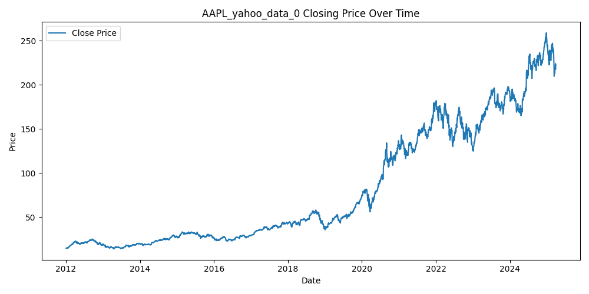

**Daily Return Distribution**  
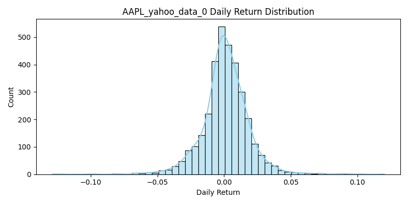

**Moving Averages**  
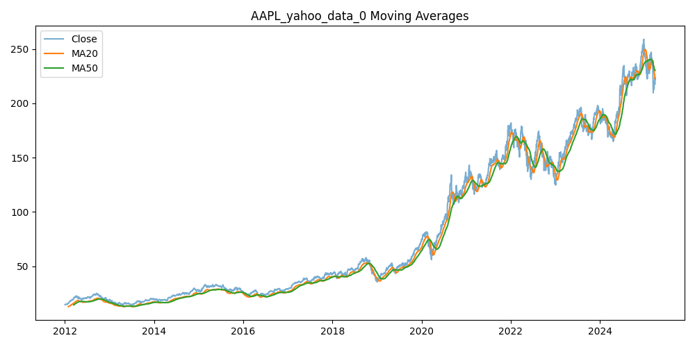

**Volatility**  
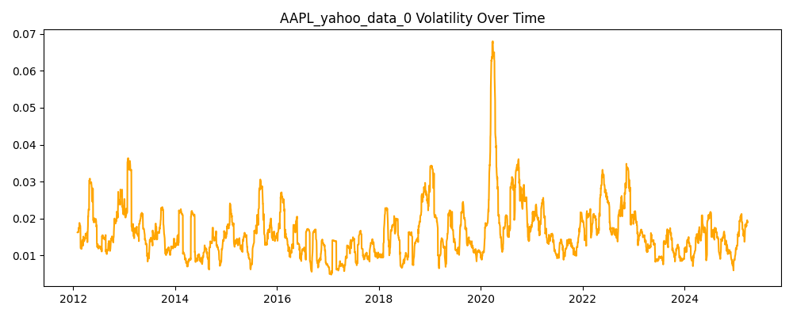

---

### 4.2 Amazon (AMZN)

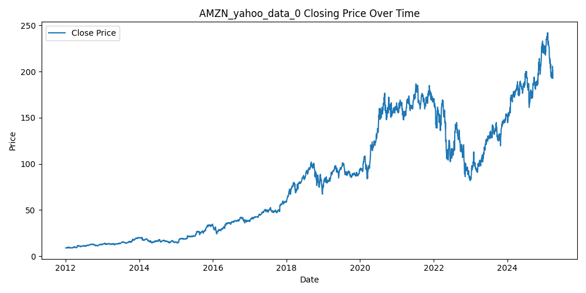  
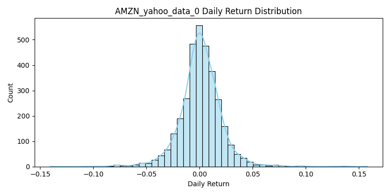  
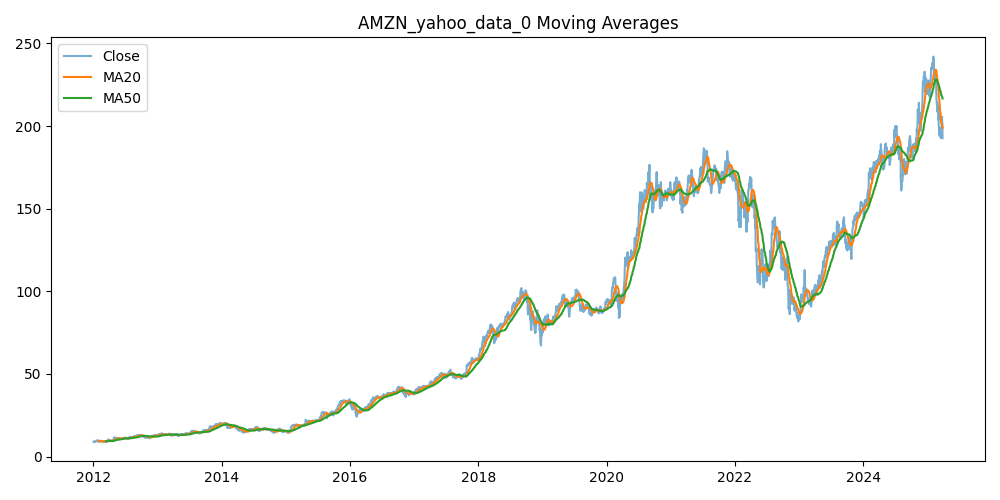  
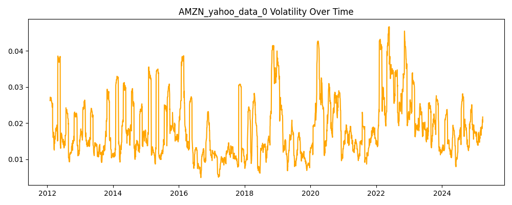

---

### 4.3 Nike (NKE)

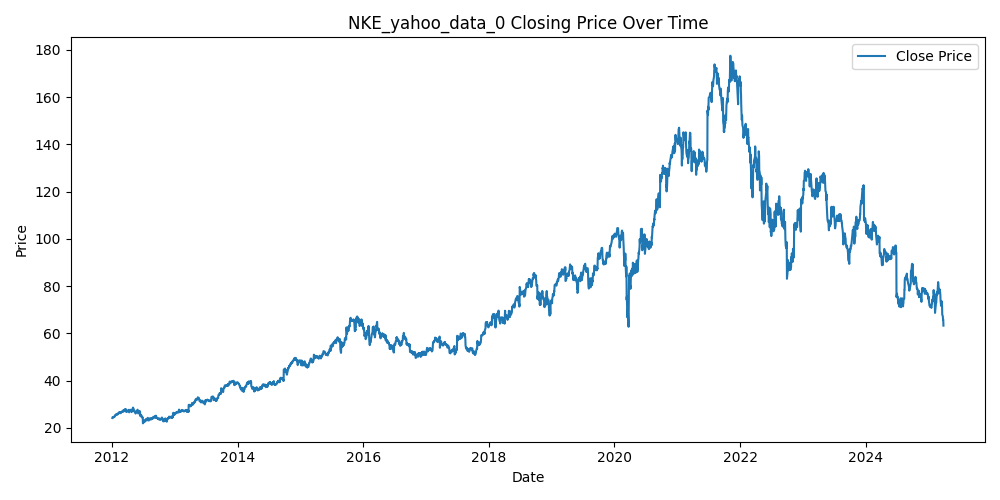  
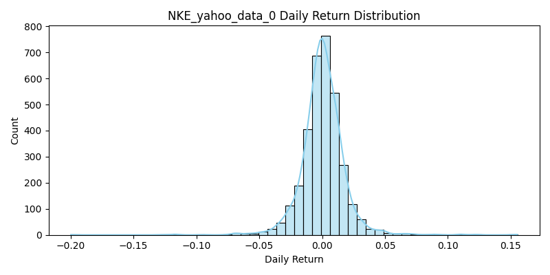  
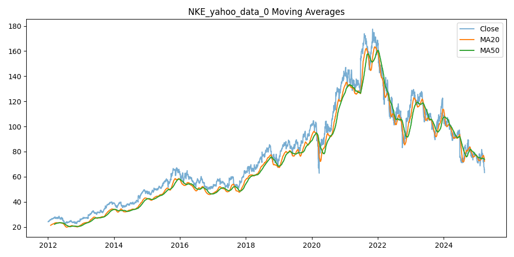  
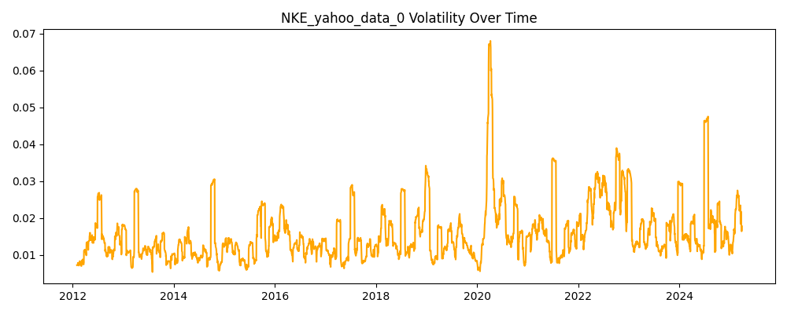

---

### 4.4 NVIDIA (NVDA)

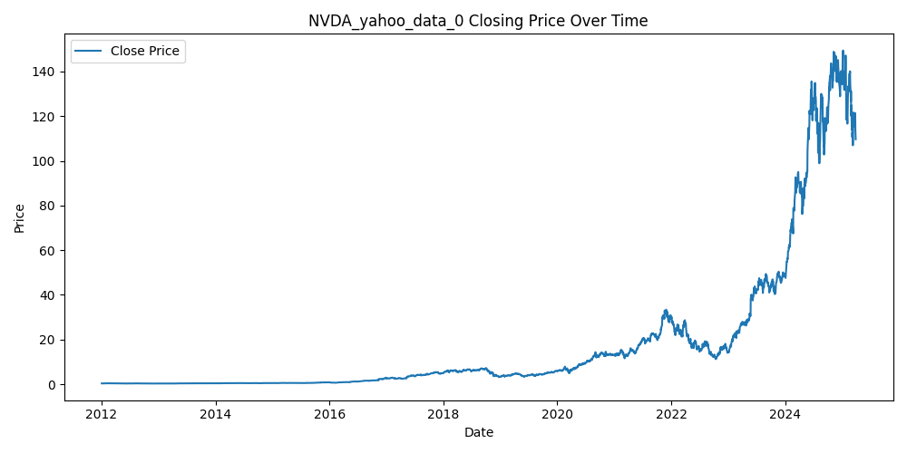  
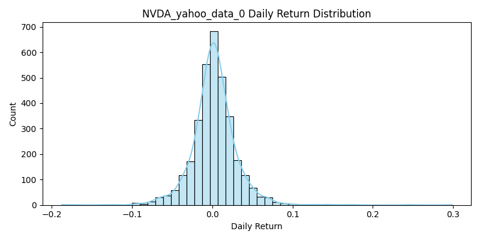  
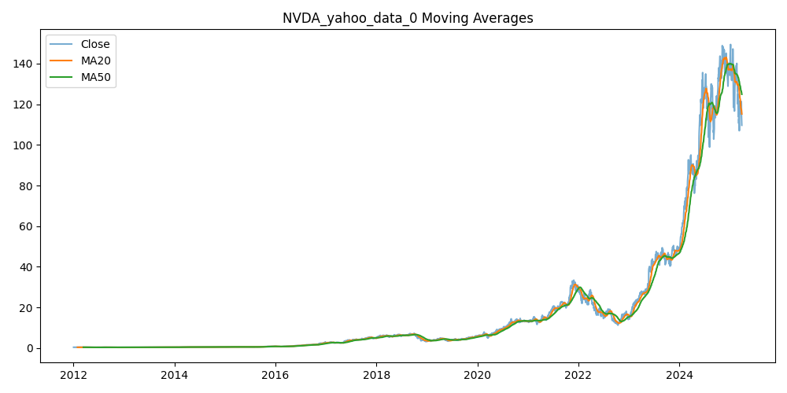  
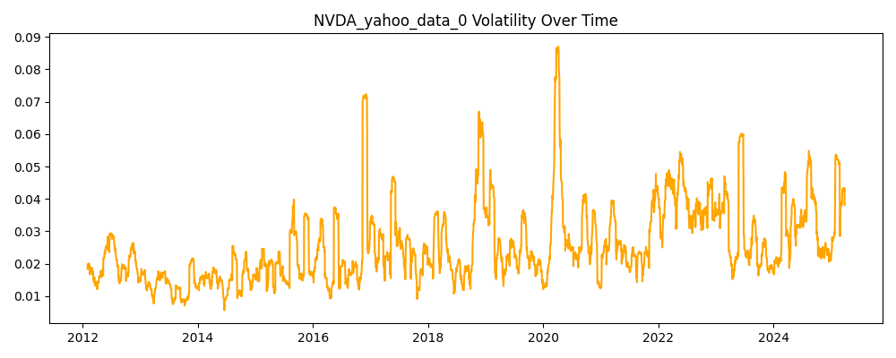

---

### 4.5 Tesla (TSLA)

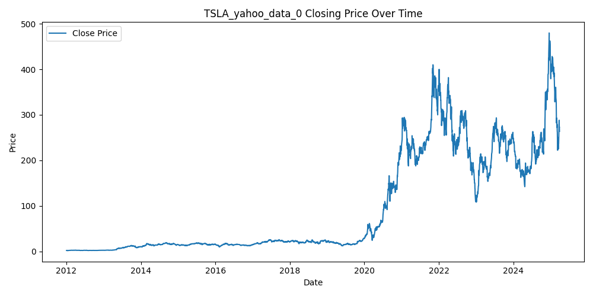  
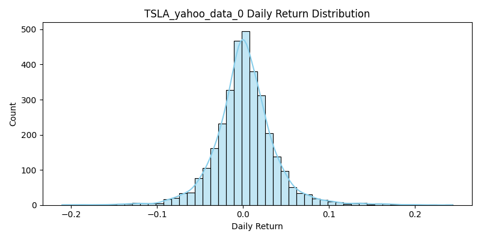  
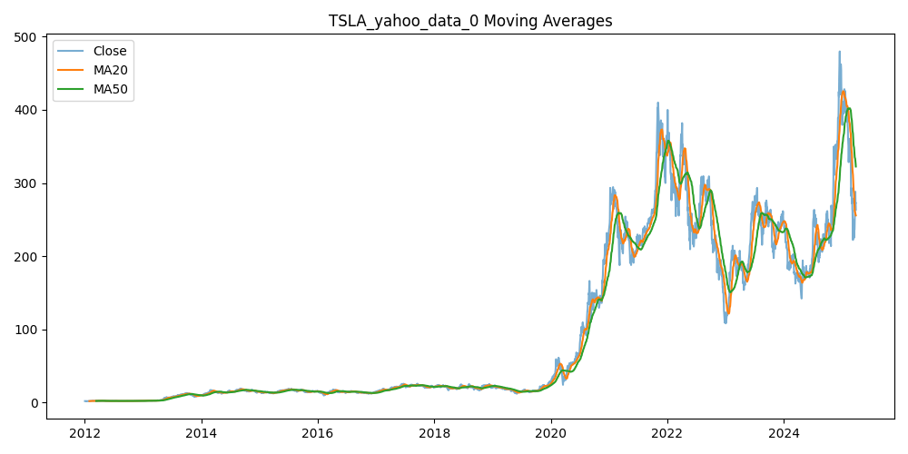  
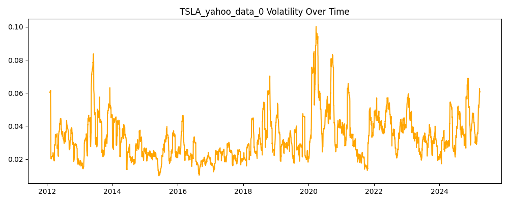

---

## 5. Observations

- **Price Trends**: Most companies exhibit long-term growth trends with short-term fluctuations.
- **Return Distributions**: All return distributions are right-tailed with varying kurtosis, indicating occasional large positive jumps.
- **Moving Averages**: MA20 and MA50 help capture short- and medium-term trends. Crossover points often signal trend changes.
- **Volatility**: Periods of high volatility correlate with macroeconomic events and market uncertainty.

---

## 6. Conclusion

This EDA serves as a foundation for deeper modeling, such as volatility prediction, return forecasting, or portfolio optimization. Future work can explore statistical tests, ARIMA models, or machine learning-based predictions.

---

Report generated on: Apr 6th
